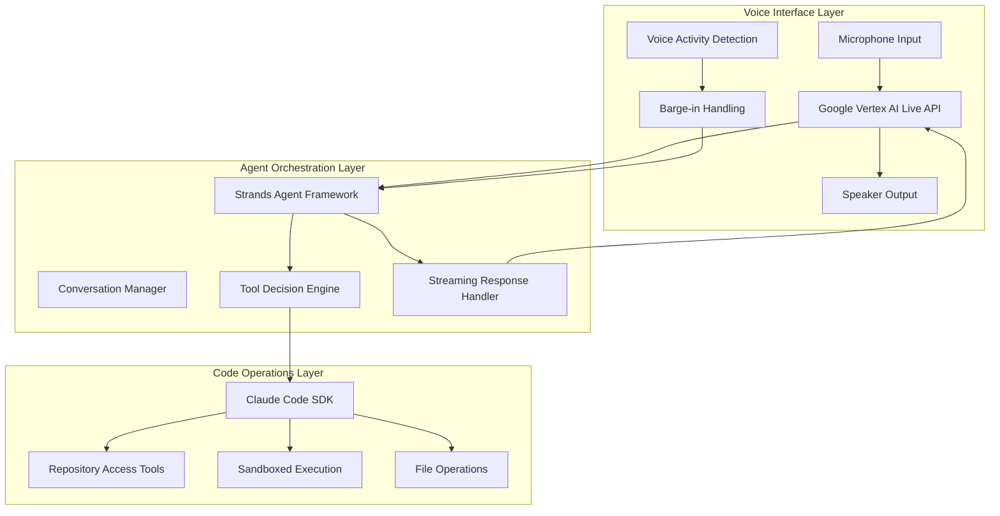

# Design Document

## Overview

The Voice-Enabled AI Coding Assistant is a Python-based real-time conversational system that allows developers to interact with AI using natural voice commands for intelligent code assistance. The system leverages Google Vertex AI Live API for integrated speech-to-speech conversations, Strands Agents Framework for intelligent agent orchestration, and Claude Code SDK for secure repository operations across any programming language.

**Note: This design is intended as a starting point and will be iteratively refined during development as we gain deeper understanding of user needs, technical constraints, and optimal implementation approaches.**

The architecture consists of three main components:
1. **Voice Interface Layer** - Handles bidirectional voice streaming using Google Vertex AI Live API
2. **Agent Orchestration Layer** - Uses Strands Agents Framework for intelligent conversation and tool management
3. **Code Operations Layer** - Leverages Claude Code SDK for secure repository access and operations

## Architecture



## Components and Interfaces

### Voice Interface Layer

**Technology Stack:**
- Python 3.10+ with Google Cloud client libraries
- Google Vertex AI Live API for integrated speech-to-speech
- Chirp 3 HD voices for natural speech synthesis
- WebSocket connections for bidirectional audio streaming

**Key Interfaces:**
- `VertexLiveClient`: Manages bidirectional streaming connection to Vertex AI Live API
- `AudioStreamManager`: Handles PCM audio streaming and buffering
- `VoiceActivityDetector`: Built-in VAD from Vertex AI Live API
- `ConversationSession`: Manages session state and audio flow

**Audio Flow:**
1. Continuous microphone capture (16 kHz PCM)
2. Real-time streaming to Vertex AI Live API
3. Integrated speech-to-speech processing with Gemini model
4. Automatic barge-in detection and handling
5. Chirp 3 HD voice synthesis for responses
6. Natural conversation flow with minimal latency

### Agent Orchestration Layer

**Technology Stack:**
- Python with Strands Agents Framework (v1.14.0+)
- Claude Sonnet 4.5 model for intelligent reasoning
- Built-in conversation management and memory
- Model Context Protocol (MCP) for tool integration

**Key Interfaces:**
- `StrandsAgent`: Main agent class with Claude Code tools
- `ConversationManager`: Handles multi-turn conversation state
- `ToolOrchestrator`: Manages tool selection and execution
- `StreamingHandler`: Processes real-time agent responses

**Core Functionality:**
- Receives voice input from Vertex AI Live API
- Uses model-driven approach for intelligent decision making
- Automatically decides when to use code analysis tools
- Manages conversation context and memory
- Streams responses back to voice interface
- Handles interruptions and conversation flow

**Agent Configuration:**
- Model: `claude-sonnet-4-5-20250929` for production reasoning
- Tools: Claude Code SDK tools (Read, Grep, Glob, Bash)
- Permission Mode: Configurable (plan, acceptEdits, auto)
- Streaming: Real-time response streaming enabled
- Memory: Built-in conversation windowing and summarization

### Code Operations Layer

**Technology Stack:**
- Claude Code SDK (claude-agent-sdk v0.1.6+)
- Python integration with Strands framework
- Built-in sandboxing (bubblewrap on Linux, Seatbelt on macOS)
- Indexed search capabilities (ripgrep, ctags, tree-sitter)

**Key Interfaces:**
- `ClaudeCodeTool`: Strands tool wrapper for Claude Code operations
- `RepositoryManager`: Manages access to any programming language repository
- `SafeExecutor`: Handles sandboxed command execution
- `FileOperations`: Provides secure file read/write operations

**Execution Model:**
- Claude Code SDK integrated as Strands tools
- Support for any programming language repository
- Intelligent tool selection by Strands agent
- Built-in security and sandboxing
- Streaming JSON I/O for real-time operations

**Tool Configuration:**
```python
# Strands agent with Claude Code tools
agent = Agent(
    model="claude-haiku-4-5-20251001",
    tools=[claude_code_read, claude_code_grep, claude_code_bash],
    system_prompt="You are a senior engineer assistant..."
)
```

## Data Models

### Voice Session
```python
@dataclass
class VoiceSession:
    session_id: str
    user_id: str
    status: Literal['active', 'paused', 'ended']
    vertex_session: Any  # Vertex AI Live API session
    agent: Agent  # Strands agent instance
    audio_state: AudioState

@dataclass
class AudioState:
    is_listening: bool
    is_speaking: bool
    current_audio_chunk: bytes
    interruption_count: int
```

### Strands Agent Configuration
```python
@dataclass
class AgentConfig:
    model: str = "claude-haiku-4-5-20251001"
    tools: List[Tool]
    system_prompt: str
    permission_mode: Literal['plan', 'acceptEdits', 'auto']
    max_turns: int = 10
    streaming: bool = True

class ClaudeCodeTool:
    """Strands tool wrapper for Claude Code operations"""
    def __init__(self, operation: str, allowed_paths: List[str]):
        self.operation = operation
        self.allowed_paths = allowed_paths
```

### Repository Operations
```python
@dataclass
class CodeOperation:
    operation_type: Literal['read', 'search', 'grep', 'execute']
    repository_path: str
    parameters: Dict[str, Any]
    
@dataclass
class CodeResult:
    success: bool
    data: Any
    error: Optional[str]
    execution_time: float
    tool_used: str
```

## Error Handling

### Voice Processing Errors
- **Vertex AI Live API Failures**: Automatic reconnection with session state preservation
- **Audio Streaming Issues**: Built-in retry mechanisms with graceful degradation
- **Network Connectivity**: Connection pooling and automatic recovery

### Agent Orchestration Errors
- **Strands Agent Failures**: Built-in error handling with conversation context preservation
- **Model API Timeouts**: Automatic retry with exponential backoff
- **Tool Execution Failures**: Graceful error reporting with alternative suggestions

### Code Operations Errors
- **Claude Code SDK Failures**: Built-in error handling with detailed error messages
- **Repository Access Issues**: Permission validation with clear user guidance
- **Sandboxing Violations**: Security boundary enforcement with explanatory messages
- **Command Execution Timeouts**: Partial result return with continuation options

## Testing Strategy

### Unit Testing
- Vertex AI Live API integration components
- Strands agent configuration and tool registration
- Claude Code SDK wrapper functions
- Audio streaming and session management

### Integration Testing
- End-to-end voice conversation flows with Vertex AI Live API
- Strands agent with Claude Code tool integration
- Repository operations across different programming languages
- Error handling and recovery mechanisms

### Performance Testing
- Voice-to-voice latency measurements (target: <300ms with Vertex AI Live API)
- Concurrent session handling with Strands framework
- Memory usage during long conversations with conversation management
- Code operation performance across different repository sizes

### User Experience Testing
- Natural conversation flow with integrated speech-to-speech
- Barge-in responsiveness with Vertex AI Live API
- Voice quality assessment with Chirp 3 HD voices
- Code assistance accuracy across multiple programming languages
- Agent decision-making quality for tool usage

## Security Considerations

### Built-in Security Features
- Claude Code SDK's built-in sandboxing (bubblewrap/Seatbelt)
- Strands framework's guardrails and safety hooks
- Vertex AI Live API's secure audio processing
- Automatic PII redaction in Claude Code operations

### Permission Management
- Claude Code SDK permission modes (plan, acceptEdits, auto)
- Tool allowlisting through Strands framework
- Repository path restrictions and access controls
- Command execution allowlisting with security boundaries

### Data Protection
- Secure conversation state management with Strands
- Encrypted audio streaming with Vertex AI Live API
- Temporary session storage with automatic cleanup
- Comprehensive audit logging for security monitoring

## Performance Requirements

### Latency Targets
- Integrated speech-to-speech with Vertex AI Live API: <200ms
- Strands agent response initiation: <100ms
- Claude Code tool execution: <500ms
- Total voice-to-voice latency: <300ms (with Vertex AI Live API optimization)

### Throughput Requirements
- Support for 20+ concurrent voice sessions with Strands
- Handle 200+ code operations per minute with Claude Code SDK
- Process continuous audio streams with Vertex AI Live API

### Resource Utilization
- Memory usage: <256MB per session (optimized with Strands)
- CPU usage: <30% during active conversations
- Network bandwidth: <500Kbps per session (optimized audio streaming)

## Deployment Architecture

### Development Environment
- Python 3.10+ runtime with virtual environment
- Google Cloud Vertex AI Live API integration
- Strands Agents Framework with Claude Code SDK
- Local repository access for development

### Infrastructure Components
- Python FastAPI or Flask application server
- WebSocket connections for audio streaming
- Google Cloud Vertex AI Live API integration
- Strands agent orchestration with built-in monitoring

### Audio Streaming Architecture

**Vertex AI Live API Integration:**
The system uses Google Vertex AI Live API for integrated speech-to-speech processing, eliminating the need for separate STT/TTS components:

- **Bidirectional Streaming**: Single WebSocket connection handles both audio input and output
- **Built-in VAD**: Voice Activity Detection and barge-in handling included
- **Integrated Processing**: Speech recognition, LLM processing, and speech synthesis in one pipeline
- **Low Latency**: Optimized for real-time conversation with minimal delay

**Architecture Benefits:**
- Simplified audio pipeline with single API integration
- Built-in conversation management and session handling
- Automatic audio quality optimization and noise reduction
- Native support for interruption and barge-in scenarios

### Configuration Management
- Environment variables for Google Cloud and API credentials
- Python configuration files for agent and tool settings
- Strands framework configuration for model and tool selection
- Repository path configuration for code operations

## Design Evolution Notes

This design document represents our initial understanding and will evolve during implementation:

- **Technology Stack**: Python-first approach with Strands Agents Framework for intelligent orchestration
- **Voice Integration**: Vertex AI Live API provides integrated speech-to-speech with minimal latency
- **Agent Intelligence**: Strands' model-driven approach enables intelligent tool selection and conversation management
- **Repository Support**: Claude Code SDK supports any programming language, not limited to specific frameworks
- **Performance Optimization**: Integrated APIs reduce complexity and improve response times
- **Security Foundation**: Built-in security features from Claude Code SDK and Strands framework